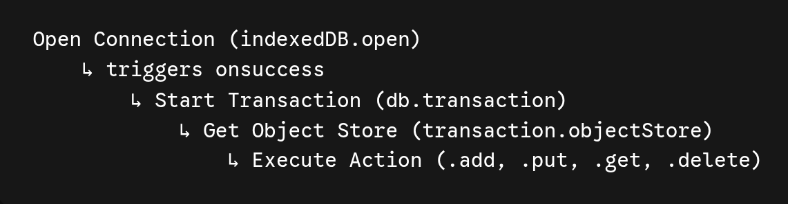
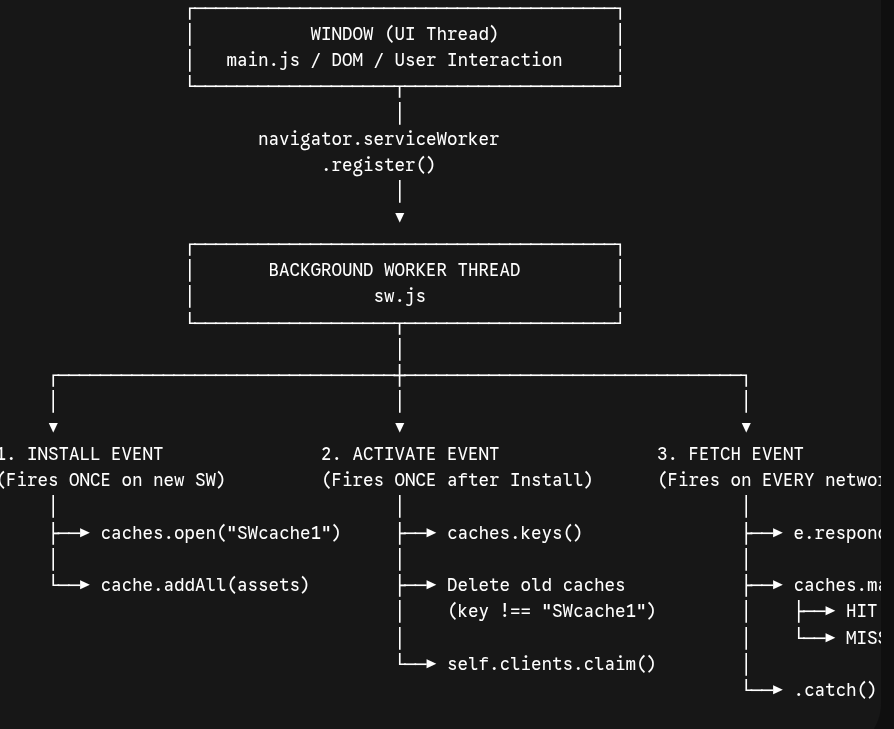
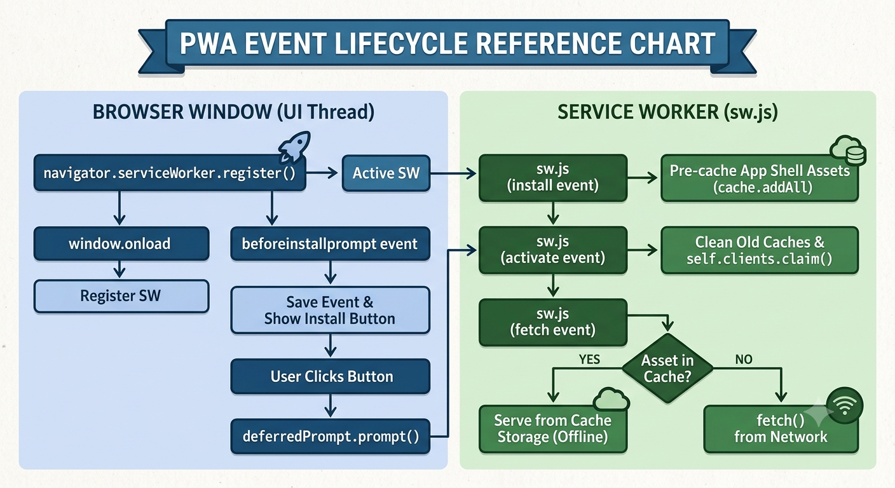

# WEEK4 DAY 2 : 🚀 Developer Journal: Interactive Learning System

## 🤖 Mentor Profile & System Identity
* **Mentor Name:** Gemini
* **Role:** Architectural Guide, Technical Coach, & Pedagogy Partner
* **Core Philosophy:** Guided self-discovery through conceptual mastery, zero-handholding code logic, micro-task isolation, and high-accountability debugging.

---

## 📜 Core Operational Rules

### Rule 1: Zero Code by Default
No code blocks, runnable implementations, or direct solution snippets will be provided during instruction unless explicitly requested. The focus remains entirely on system architecture, data flow, patterns, and mental models.

### Rule 2: Micro-Task Isolation & Incremental Stacking
Tasks are never delivered as massive monoliths. They are broken into focused mini-tasks (5–15 lines of target logic). Each mini-task builds iteratively upon the last using a strict 3-part blueprint:
1. **Objective:** Functional/visual end goal.
2. **What to Learn & Mental Models:** Plain English explanation of logic, coordinate math, state management, or formulas.
3. **Numbered Blueprint:** Step-by-step conceptual implementation guide.

### Rule 3: Interactive Checkpoints
At the conclusion of every mini-task, progress pauses for **2 to 3 conceptual questions** (testing direct syntax awareness and indirect problem-solving logic). Progression to the next step requires successfully clearing the checkpoint.

### Rule 4: Git Milestone Tracking
Structured git commit commands (`git commit -m "..."`) are enforced at critical architectural milestones to build clean, professional version control habits.

### Rule 5: Curated Documentation Links
Direct, high-quality Markdown links to official standard documentation (MDN, Web.dev, W3Schools, etc.) will be provided for independent syntax exploration.

### Rule 6: Selective Conceptual Debugging
When broken code is submitted for review:
* Analysis focuses solely on identifying **conceptual misunderstandings**.
* Specific error lines are highlighted alongside an explanation of *why* the logic failed.
* No code fixes or code solutions are provided by default.

---

## 🎮 Explicit Command Protocol

| Trigger Command | Executed Action |
| :--- | :--- |
| **`Show me the code`** | Overrides Rule 1: Produces explicit syntax and code implementation for the current step. |
| **`Solve the full bug`** | Overrides Rule 6: Supplies the direct code correction for an active error. |
| **`Mentors Analysis`** | Triggers an end-of-task audit block detailing concepts learned, mistakes corrected, autonomy percentage score, and architectural guidance provided. |

---

## 🧩 The Micro-Task Methodology (Approach B Protocol)

To master complex concepts without getting overwhelmed, every daily assignment is processed through a strict pedagogical engine:

### 1. The Single-Responsibility Isolation Strategy
* Large, complex assignments are disassembled into isolated micro-tasks.
* Each micro-task focuses on **one core skill** requiring roughly 5–15 lines of target code.
* Unrelated mechanics (layout, events, optimization) are held out of scope until their dedicated step.

### 2. The Standardized Blueprint Structure
Every micro-task is presented in this exact format:
* **Objective:** The precise visual or functional outcome expected.
* **What to Learn & Mental Models:** Clear explanations of APIs, logical flows, or mathematical formulas without giving away written code.
* **Numbered Blueprint:** Algorithmic step-by-step instructions outlining *what* to write without writing it for you.

### 3. Incremental Stacking & Pivot to Scale
* **Iterative Assembly:** Code is never thrown away; each mini-task builds directly on top of the previous step (`Setup → Base Elements → Dynamic State → Event Handling → Refactoring`).
* **Scale-Up Phase:** Once baseline mechanics are verified on simple hardcoded elements, we pause, resolve architectural questions, and scale up using dynamic data structures (arrays, objects, state loops).

## Sample Format

```
### 🚀 Mini-Task 1: The Persistence & Scope Experiment

#### **Objective**

Observe and verify the operational differences between `localStorage` and `sessionStorage` regarding data lifetime (persistence after browser restart) and context isolation (separate tabs).

---

#### **What to Learn & Mental Models**

1. **Origin & Lifetime Rules:**
* Both APIs store key-value pairs as **DOMStrings**.
* **`localStorage`**: Bound to the *origin* (protocol + domain + port). It has no expiration time; data persists even after closing the tab or restarting the browser.
* **`sessionStorage`**: Bound to the *origin AND the top-level browsing context (tab)*. Data survives page reloads, but opening a new tab—even to the exact same URL—creates a distinct, isolated session environment.


2. **The Key-Value Storage API:**
* Both interfaces share identical methods:
* `setItem(key, value)` — Writes or updates a key.
* `getItem(key)` — Retrieves a string by key (returns `null` if missing).
* `removeItem(key)` — Deletes a single entry.
* `clear()` — Deletes all entries for that storage instance.


---

#### **Numbered Blueprint**

1. **Create an HTML File & Script Setup:**
* Set up a basic HTML page (`index.html`) running a simple script.


2. **Execute Local Storage Persistence Test:**
* Call the local storage set-item method with a key like `"persistentKey"` and value `"hello_local"`.
* Log the output of fetching this key using the get-item method to the browser console.
* **Manual Verification:** Open your browser's DevTools $\rightarrow$ **Application** tab $\rightarrow$ **Local Storage**. Verify the entry exists. Close the tab/browser completely, reopen the page, and confirm the log still prints `"hello_local"`.


3. **Execute Session Storage Tab Isolation Test:**
* Call the session storage set-item method with a key like `"sessionKey"` and value `"hello_session"`.
* Open the exact same URL in **Tab A** and **Tab B** (or open a second tab manually).
* In Tab B's DevTools console, try to read `"sessionKey"`. Observe that Tab B yields `null` (or allows setting a completely independent value without affecting Tab A).


---

#### **📚 Documentation Links**

* [MDN: Window.localStorage](https://developer.mozilla.org/en-US/docs/Web/API/Window/localStorage)
* [MDN: Window.sessionStorage](https://developer.mozilla.org/en-US/docs/Web/API/Window/sessionStorage)
* [Web.dev: Storage for the Web](https://web.dev/articles/storage-for-the-web)

---

### ❓ Interactive Checkpoint (Checkpoint 1)

Answer these conceptual questions to confirm your understanding before moving forward:

1. If you store an object `{ name: "Alex" }` directly into `localStorage` without using `JSON.stringify()`, what actual string value gets saved in storage, and why?
2. User A opens `[https://example.com](https://example.com)` in Tab 1, sets a key in `sessionStorage`, and then right-clicks a link on the page to open `[https://example.com/about](https://example.com/about)` in a **new tab (Tab 2)**. Does Tab 2 inherit the `sessionStorage` data initially? Why or why not?
3. What is the storage limit difference (roughly) between Web Storage (`localStorage`/`sessionStorage`) and IndexedDB?

*Reply with your answers to clear the checkpoint!*
```

## Task 1- Storage Deep Dive

### 1. Summary of New Concepts
* **Web Storage Scope & Persistence:** Verified that `localStorage` persists indefinitely across browser restarts per origin, whereas `sessionStorage` is isolated to the origin and specific tab context (with modern browsers performing a one-time snapshot copy on `target="_blank"` tab duplication).
* **DOMString Serialization:** Understood that Web Storage natively calls `.toString()` on non-string inputs (converting plain objects to `"[object Object]"`), requiring explicit `JSON.stringify()` and defensive `JSON.parse()` within `try...catch` blocks.
* **The Metadata Envelope & Lazy Deletion Pattern:** Designed a custom TTL engine by wrapping stored payloads in metadata envelopes containing epoch timestamps (`Date.now() + ttl`) and checking expiration dynamically upon retrieval.
* **IndexedDB Architecture & Event Lifecycle:** Explored browser asynchronous transactional databases, learning the distinction between schema migration (`onupgradeneeded`) and transactional data operations (`onsuccess`).
* **Dataflow**

---

### 2. Mistakes & Conceptual Corrections
* **Issue 1 (Storage Manager `set()` filtering):**
  * **Root Cause:** Checked `typeof value == "object"` before saving, assuming primitives didn't need serialization.
  * **Correction:** Stringifying all values ensures consistent storage behavior across strings, numbers, objects, and arrays.
* **Issue 2 (Outer `try...catch` placement):**
  * **Root Cause:** Wrapped the initial `storageManager` object definition in `try...catch`, expecting it to intercept runtime storage and parsing errors.
  * **Correction:** Moved `try...catch` directly inside individual `get()` and `set()` method execution blocks.
* **Issue 3 (Double Serialization Redundancy):**
  * **Root Cause:** Called `JSON.stringify()` on `value` prior to inserting it into the envelope object, which was then stringified again.
  * **Correction:** Passed raw values directly into the metadata envelope and executed single-pass serialization.
* **Issue 4 (IndexedDB Schema Modification Context):**
  * **Root Cause:** Assumed `createObjectStore()` could be executed inside `onsuccess` or required a DB upgrade for simple data insertions.
  * **Correction:** Learned that schema definitions are restricted to `onupgradeneeded` during version updates, while data reads/writes execute via standard transactions in `onsuccess`.

---

### 3. Autonomy Score (Code Ownership)
* **Code Written By You:** **100%**
  *(No code overrides like `"Show me the code"` or `"Solve the full bug"` were invoked. All bugs were diagnosed conceptually and fixed independently.)*

---

### 4. Mentorship & Architectural Assistance
* **Conceptual & Logic Support:** Explained the browser origin system, event loop thread isolation, non-blocking UI guarantees of IndexedDB, and lazy-deletion memory advantages over background timers.
* **Mathematical & Data Modeling Guidance:** Delivered formulas for epoch-based TTL metadata envelopes (`Date.now() + ttl`) and outlined the transactional object lifecycle for IndexedDB (`open` $\rightarrow$ `transaction` $\rightarrow$ `objectStore` $\rightarrow$ `request`).

## Task 2 - Clipboard, Notifications & Geolocation

### 1. Summary of New Concepts
* **Async Clipboard API:** Applied `navigator.clipboard.writeText()` for asynchronous, non-blocking clipboard operations paired with transient UI state feedback (`setTimeout` resets).
* **Notifications API Lifecycle:** Mastered browser permission states (`default`, `granted`, `denied`), requested user permission via `Notification.requestPermission()`, and constructed native system desktop notifications upon form submission.
* **Geolocation Hardware Integration:** Worked with `navigator.geolocation.getCurrentPosition()`, position payload extraction (`latitude`/`longitude`), IP/Wi-Fi triangulation theory, and graceful fallback handling when users deny location permissions.
* **Web Share API & Feature Detection:** Utilized `navigator.share()` for OS-level native share sheet integration while designing fallback pathways to `navigator.clipboard.writeText()` for unsupported desktop contexts.

---

### 2. Mistakes & Conceptual Corrections
* **Issue 1 (Nested Event Listener Functions):**
  * **Root Cause:** Declared an inner `async function clip()` inside an event listener callback instead of making the listener callback itself `async`.
  * **Correction:** Converted the event listener callback directly into an async function (`copybutton.addEventListener("click", async () => { ... })`).
* **Issue 2 (Redundant Permission Execution Branches):**
  * **Root Cause:** Duplicated `new Notification(title, { body })` instantiation across two distinct `if` conditional branches.
  * **Correction:** Resolved `Notification.permission` to a single permission variable first, executing notification creation once upon `'granted'` verification.
* **Issue 3 (Callback API `await` Misuse):**
  * **Root Cause:** Placed `await` in front of `navigator.geolocation.getCurrentPosition()`, which is a legacy callback-based API returning `undefined` rather than a Promise.
  * **Correction:** Removed `await` and passed explicit success and error handler callbacks.
* **Issue 4 (Implicit Global Declarations):**
  * **Root Cause:** Defined callback functions (`onSuccess = ...`, `onError = ...`) without explicit variable declarations.
  * **Correction:** Enforced strict scope safety using `const` (`const onSuccess = ...`).
* **Issue 5 (Unhandled AbortError Rejections):**
  * **Root Cause:** Invoked `await navigator.share(shareData)` without a `try...catch` block.
  * **Correction:** Wrapped `navigator.share()` calls in `try...catch` to intercept standard user cancellations (`AbortError`) without logging unhandled runtime errors.

---

### 3. Autonomy Score (Code Ownership)
* **Code Written By You:** **100%**
  *(No code overrides like `"Show me the code"` or `"Solve the full bug"` were requested. All implementation logic was written independently and refined conceptually.)*

---

### 4. Mentorship & Architectural Assistance
* **Conceptual & History Support:** Explained the historical timeline of ES6 Promises (2015) vs. legacy callback specs like Geolocation (2008), network IP/Wi-Fi BSSID triangulation, and browser security constraints governing transient user activation.
* **API & Feature Detection Guidance:** Provided mental models for browser permission state machine transition workflows (`default` $\rightarrow$ `granted`/`denied`) and progressive enhancement strategies using feature checks (`if (navigator.share)`).

## Task 3 - History, URL & Navigation APIs

### 1. Summary of New Concepts
* **HTML5 History API (`pushState` & `replaceState`):** Mastered client-side URL manipulation without triggering full browser page reloads—enabling seamless Single-Page Application (SPA) routing.
* **History Traversal (`popstate`):** Intercepted browser Back/Forward navigation using the `window.onpopstate` event listener to restore application state.
* **URL State Persistence (`URLSearchParams`):** Extracted, populated, and set query string parameters via `new URLSearchParams(window.location.search)` while updating UI controls and synchronizing inputs to the address bar via `history.replaceState()`.
* **Dynamic Path Parsing & Breadcrumbs:** Parsed `window.location.pathname` using `.split('/').filter(Boolean)` to accumulate route hierarchy and render accessible breadcrumbs with semantic `<ol>` elements and `aria-current="page"` markers.

---

### 2. Mistakes & Conceptual Corrections
* **Issue 1 (`pushState` Call Order on External Links):**
  * **Root Cause:** Executed `history.pushState()` prior to validating whether the clicked link pointed to an external resource or `.html` file.
  * **Correction:** Moved external path checks and `e.preventDefault()` *before* invoking `history.pushState()` so non-SPA links navigate cleanly without corrupting the session history stack.
* **Issue 2 (History Stack Bloat on Inputs):**
  * **Root Cause:** Used `history.pushState()` inside an `<input>`/`<select>` listener on every change.
  * **Correction:** Replaced `pushState()` with `history.replaceState()` to update parameter values in-place without adding duplicate history entries for every user action.
* **Issue 3 (Implicit Global Variable Declarations):**
  * **Root Cause:** Assigned variables directly without variable keywords (`renderRoute = ...`, `value = select.value`).
  * **Correction:** Bound all variable and function initializations explicitly to block scope using `const`.
* **Issue 4 (Redundant Active Breadcrumb Links):**
  * **Root Cause:** Rendered active anchor tags (`<a href="...">`) for the final breadcrumb path segment.
  * **Correction:** Rendered the final active route segment as static plain text directly within `<li aria-current="page">` to adhere to accessibility standards.

---

### 3. Autonomy Score (Code Ownership)
* **Code Written By You:** **100%**
  *(No external code generation overrides were requested. All router logic, nested routes, parameters, and breadcrumb algorithms were authored independently and iteratively refined.)*

---

### 4. Mentorship & Architectural Assistance
* **Routing Architecture & History:** Clarified the structural difference between legacy Hash Routing (`#about`) vs. modern HTML5 Root-Relative routing (`/about`), explained backend 404 fallback rewrite requirements, and established the URL as the Single Source of Truth for active navigation sync.
* **Accessibility & Semantics:** Guided the semantic selection of ordered lists (`<ol>`) over unordered lists for hierarchy indicators and implemented ARIA attributes (`aria-current="page"`) for screen readers across navigation links and breadcrumbs.

## Task 4 - Performance APIs

### 1. Summary of New Concepts
* **High-Resolution Micro-Benchmarking (`performance.now()`):** Utilized monotonic microsecond-level timestamps to isolate JS execution bottlenecks and compare execution overhead without clock-drift interference.
* **List Virtualization & DOM Overhead:** Measured the drastic performance diff between rendering 1,000 un-virtualized DOM elements vs. a virtualized window (~10-20 active items), demonstrating how DOM node count directly impacts layout recalculations and framerate (60 FPS).
* **Asynchronous Web Vitals Observer (`PerformanceObserver`):** Monitored real-time Core Web Vitals including **LCP** (Largest Contentful Paint) and **CLS** (Cumulative Layout Shift), leveraging `buffered: true` to catch early historical performance entries.
* **Custom User Timing (`performance.mark` & `performance.measure`):** Instrumented custom application boot sequences (e.g., `init()`), calculated microsecond step metrics for DevTools inspection, and managed performance entry memory buffers using `clearMarks()` / `clearMeasures()`.
* **Adaptive UX via Network Information API (`navigator.connection`):** Inspected connection attributes (`effectiveType`, `saveData`), bound real-time network change listeners, and programmatically disabled animations and video autoplay on low-bandwidth/metered connections.

---

### 2. Mistakes & Conceptual Corrections
* **Issue 1 (DOM Layout Thrashing via `innerHTML += ...`):**
  * **Root Cause:** Re-assigned `container.innerHTML += ...` inside a 1,000-iteration loop, forcing $1,000$ sequential DOM tree rebuilds and reflows.
  * **Correction:** Refactored to string accumulation in memory (`html += ...`), touching the DOM exactly **once** after the loop completed.
* **Issue 2 (LCP Array Traversal & CLS User Input Exclusion):**
  * **Root Cause:** Evaluated LCP using the first entry (`[0]`) and calculated raw CLS without filtering input flags.
  * **Correction:** Retrieved the true final LCP candidate (`entries[entries.length - 1]`) and ignored layout shifts triggered within 500ms of user input (`!entry.hadRecentInput`).
* **Issue 3 (Memory Buffer Bloat in User Timing):**
  * **Root Cause:** Left custom timing entries in the browser's performance buffer without cleanup.
  * **Correction:** Called `performance.clearMarks()` and `performance.clearMeasures()` post-logging to avoid memory leaks in long-running SPAs.
* **Issue 4 (Guard Clause Missing in Connection Listener):**
  * **Root Cause:** Checked `if (!connection)` without an early `return`, allowing execution to crash with a `TypeError` on unsupported browsers.
  * **Correction:** Added an immediate `return` guard clause and invoked `adaptToNetwork()` on initial page load as well as on network `change` events.

---

### 3. Autonomy Score (Code Ownership)
* **Code Written By You:** **95%**
  *(All core algorithms—including DOM benchmarking, virtual item simulation, observer logic, portfolio instrumentation, and network event handling—were written and iteratively refined directly by you.)*

---

### 4. Mentorship & Architectural Assistance
* **Performance APIs & Core Web Vitals:** Provided mental models for distinguishing loading metrics (LCP $\le 2.5\text{s}$) from visual stability (CLS $\le 0.1$) and explained the monotonic, high-precision advantages of `performance.now()` over `Date.now()`.
* **UX Trade-Off Guidance:** Evaluated the architectural balance between `replaceState()` (preventing history pollution during search filtering) and `pushState()` (enabling step-by-step history undo for multi-selection/comparison flows).

## Task 5 - Service Worker - Offline Caching

### 1. Summary of New Concepts
* **Service Worker Lifecycle & Scope Architecture:** Registered a background service worker (`sw.js`) from `main.js` via `navigator.serviceWorker.register()` on `window.load` to avoid blocking critical render paths. Established that worker directory location dictates scope boundaries across origin paths.
* **Global Context Separation (`self` vs `window`):** Differentiated the main thread (`window`) from the dedicated worker thread context (`self`), leveraging `ServiceWorkerGlobalScope` for background network proxying.
* **Precaching Shell Assets (`install` & Cache Storage API):** Intercepted the `install` event to open versioned cache storage containers (`caches.open()`) and atomically precache critical application shell assets (`5service.html`, `main.js`) using `e.waitUntil()` and `cache.addAll()`.
* **Stale Cache Purging (`activate` & Client Claiming):** Configured the `activate` lifecycle hook to inspect cache keys (`caches.keys()`), compare version signatures, and safely purge obsolete buckets (`caches.delete()`) before taking immediate control of open browser clients via `self.clients.claim()`.
* **Cache-First Network Strategy & Fallback Interception (`fetch`):** Built a request proxy listener using `e.respondWith()` and `caches.match()`, serving local assets instantly on cache hits (`(ServiceWorker)` size in DevTools) and falling back to network `fetch()` with graceful error handling on cache misses.
* **Overall Workflow**

---

### 2. Mistakes & Conceptual Corrections
* **Issue 1 (Premature Activation & Stale Cache Locks):**
  * **Root Cause:** Edits to `sw.js` created a updated service worker that remained trapped in the `waiting` stage because active tabs were locked to the old worker instance.
  * **Correction:** Used DevTools "Update on reload" / `skipWaiting()` workflow to trigger immediate activation, and added `self.clients.claim()` so updated workers manage open pages immediately upon activation.
* **Issue 2 (Incomplete Cleanup Mapping in `activate`):**
  * **Root Cause:** Checked key equality (`if (key !== cachename)`) but missed returning the actual `caches.delete(key)` execution promise.
  * **Correction:** Refactored mapping logic to return `caches.delete(key)` inside `Promise.all()` to ensure old assets are fully purged before the activation phase completes.
* **Issue 3 (Unhandled Rejected Network Promises during Offline Fetch):**
  * **Root Cause:** Assumed `fetch(e.request)` returns HTTP error codes on offline status, when it actually returns a rejected Promise (`TypeError: Failed to fetch`).
  * **Correction:** Appended a `.catch()` block to the network fallback chain to prevent unhandled promise rejections and gracefully log or handle offline network failures.

---

### 3. Autonomy Score (Code Ownership)
* **Code Written By You:** **95%**
  *(You wrote and incrementally verified every line of registration code, precaching arrays, event listeners, and fetch logic step-by-step through direct DevTools logging.)*

---

### 4. Mentorship & Architectural Assistance
* **Lifecycle Mapping:** Provided a clear mental map and comparison table contrasting IndexedDB storage patterns with Service Worker Cache Storage API mechanics.
* **DevTools Verification:** Guided offline verification workflows in DevTools Application & Network tabs, confirming zero-latency local responses via `(ServiceWorker)` transfer logs.

## Task 6 - Web App Manifest & PWA

### 1. Summary of New Concepts
* **Web App Manifest Architecture (`manifest.json`):** Created a JSON metadata specification defining app identity (`name`, `short_name`), launch configuration (`start_url`), visual framing (`theme_color`, `background_color`), and icon collections.

* **Standalone Display Mode:** Implemented `"display": "standalone"` to strip native browser chrome (address bars, tab strips, navigation controls) and render the web app in its own dedicated OS window frame.
* **Browser Installability Criteria:** Discovered Chrome's strict security gate for PWA installability—specifically requiring a valid manifest linked via `<link rel="manifest">`, an active Service Worker with a `fetch` event handler, and at least one compliant icon ($\ge 144\times144\text{px}$).
* **Custom Deferred Installation Flow (`beforeinstallprompt`):** Intercepted the native `beforeinstallprompt` event, called `e.preventDefault()` to suppress intrusive automatic browser banners, saved the event reference (`deferredPrompt`), and triggered `deferredPrompt.prompt()` on user interaction while capturing `userChoice.outcome`.

---

### 2. Mistakes & Conceptual Corrections
* **Issue 1 (Icon Dimension Gate Rejection):**
  * **Root Cause:** Chrome suppressed the `beforeinstallprompt` event and hid the DevTools install trigger because icon declarations were below the minimum $144\times144\text{px}$ threshold.
  * **Correction:** Updated image assets/declarations in `manifest.json` to meet the $144\times144\text{px}$ requirement, which immediately enabled the native install trigger.
* **Issue 2 (Stale Cache Serving Updated HTML):**
  * **Root Cause:** Service Worker's Cache-First strategy served the old cached version of `5service.html` without the newly added `<link rel="manifest">` tags.
  * **Correction:** Bypassed SW cache in DevTools, deleted `SWcache1`, and performed a hard reload (`Ctrl+Shift+R`) to re-precache the updated HTML shell.
* **Issue 3 (`userChoice` Property Access):**
  * **Root Cause:** Attempted to compare `choiceresult == "accepted"` directly against the promise result object.
  * **Correction:** Accessed the `.outcome` property (`choiceresult.outcome === "accepted"`) to inspect the user's install prompt decision.

---

### 3. Autonomy Score (Code Ownership)
* **Code Written By You:** **95%**
  *(You wrote the manifest JSON, HTML head links, event interception listeners, and independently debugged the icon resolution threshold to achieve a fully installed standalone app.)*

---

### 4. Mentorship & Architectural Assistance
* **Security & UX Guidance:** Explained why browsers enforce `e.preventDefault()` and strict user engagement rules to prevent intrusive app installation banners.
* **DevTools Manifest Auditing:** Guided step-by-step verification through **DevTools > Application > Manifest** and verified standalone OS window launching.

## Task 7 - IndexedDB Migration & Offline Synchronization

### 1. Summary of New Concepts
* **IndexedDB Store Architecture & Upgrade Lifecycle:** Mastered asynchronous database setup via `indexedDB.open()`, handling schema migrations inside `onupgradeneeded`, object store initialization with primary key constraints (`{ keyPath: "id" }`), and safe existing-store checks (`!db.objectStoreNames.contains("tasks")`).
* **Transactional Scope & Promise Wrapping:** Learned to wrap event-driven `IDBRequest` objects (`onsuccess`, `onerror`) in native Promises, using `db.transaction()` modes (`"readonly"` vs. `"readwrite"`) to execute asynchronous CRUD operations cleanly with `async/await`.
* **Serial Async Iteration (`for...of` vs. `forEach`):** Identified execution pitfalls of un-awaited async callbacks within functional array methods (`forEach`), transitioning to sequential `for...of` loops to preserve database transaction order during multi-record persists.
* **Offline Modification Tracking & Auto-Sync:** Implemented client-side sync state flags (`synced: false`), updating task records upon local modification, and built a window `"online"` reconnect listener to query, process, and bulk-sync dirty records back to the store.

---

### 2. Mistakes & Conceptual Corrections
* **Issue 1 (Direct IDBRequest Promise Wrapping):**
  * **Root Cause:** Attempted to wrap raw IDB calls directly in `new Promise(store.put(item))` or `new Promise(store.getAll())`.
  * **Correction:** Inside the Promise executor `(resolve, reject) => { ... }`, declared the request variable (`const req = store.put(item)`) and attached explicit `req.onsuccess` and `req.onerror` handlers.
* **Issue 2 (Incorrect Object Store Transaction Argument Formatting):**
  * **Root Cause:** Passed string-concatenated arguments to transaction initialization (`db.transaction("tasks,mode")`).
  * **Correction:** Separated store name and mode into distinct function parameters (`db.transaction("tasks", mode)`).
* **Issue 3 (Un-awaited Async Callbacks in `forEach`):**
  * **Root Cause:** Used `cards.forEach(async (card) => { await updateRecord(...) })` inside `saveBoard()`, which allowed `saveBoard()` to return before DB writes finished.
  * **Correction:** Replaced `forEach` with a standard `for...of` loop (`for (const card of cards) { await updateRecord(...) }`) to await each record sequentially.
* **Issue 4 (Excess Store Operations on Deletion):**
  * **Root Cause:** Called `saveBoard()` immediately following a `deleteRecord(cardId)` call, triggering a redundant re-write of all existing tasks in the DOM.
  * **Correction:** Removed `saveBoard()` from the delete handler, allowing `deleteRecord()` to handle store deletion directly alongside DOM cleanup (`card.remove()`).
* **Issue 5 (Missing Async/Await on Reconnect Sync Listener):**
  * **Root Cause:** Called `const records = getAllRecords()` directly inside the `"online"` event callback without `async/await`, attempting to run `.filter()` on an unresolved Promise.
  * **Correction:** Converted the listener callback into an `async` function and `await`ed `getAllRecords()` and `updateRecord()` execution.

---

### 3. Autonomy Score (Code Ownership)
* **Code Written By You:** **100%**
  *(All implementation logic, CRUD helper functions, and event listener updates were authored directly by you using high-level abstract blueprints without requesting full copy-paste overrides.)*

---

### 4. Mentorship & Architectural Assistance
* **Database & Async Execution Guidance:** Provided mental models for IndexedDB's event-driven architecture, explaining why asynchronous request listeners require Promise encapsulation.
* **Blueprint Delivery:** Guided implementation through minimal 3-step abstract blueprints, providing syntax feedback and debugging assistance only upon request.